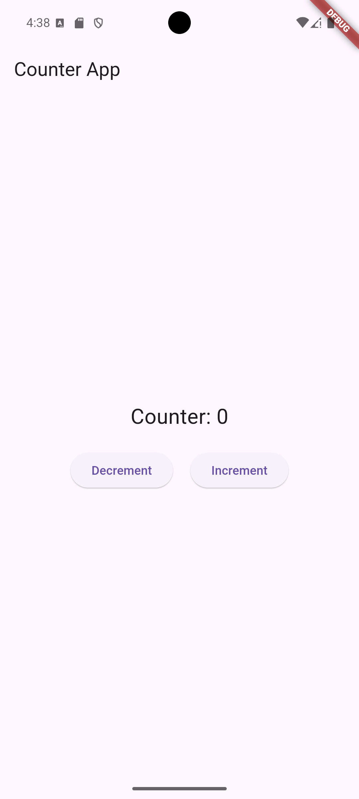
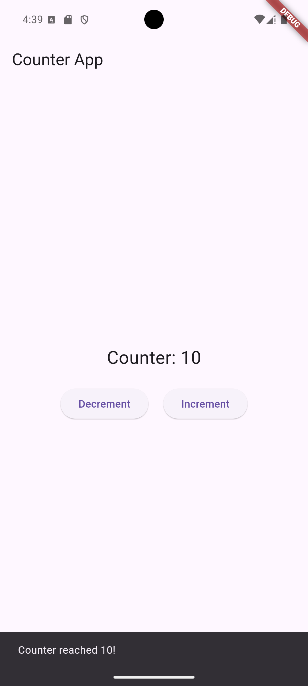
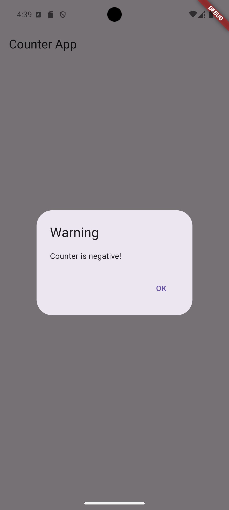

# Counter App with Flutter BLoC

This is a simple counter app built using the `flutter_bloc` package. It demonstrates the use of `Cubit`, `BlocBuilder`, `BlocListener`, and `BlocConsumer`.

## Features
- Increment and decrement counter.
- Show a dialog when the counter is negative.
- Show a snackbar when the counter reaches 10 or -10.

## Screenshots

### Counter

### Counter reach 10

### Counter reach negative count

## How to Run
1. Clone the repository.
2. Run `flutter pub get`.
3. Run `flutter run`.